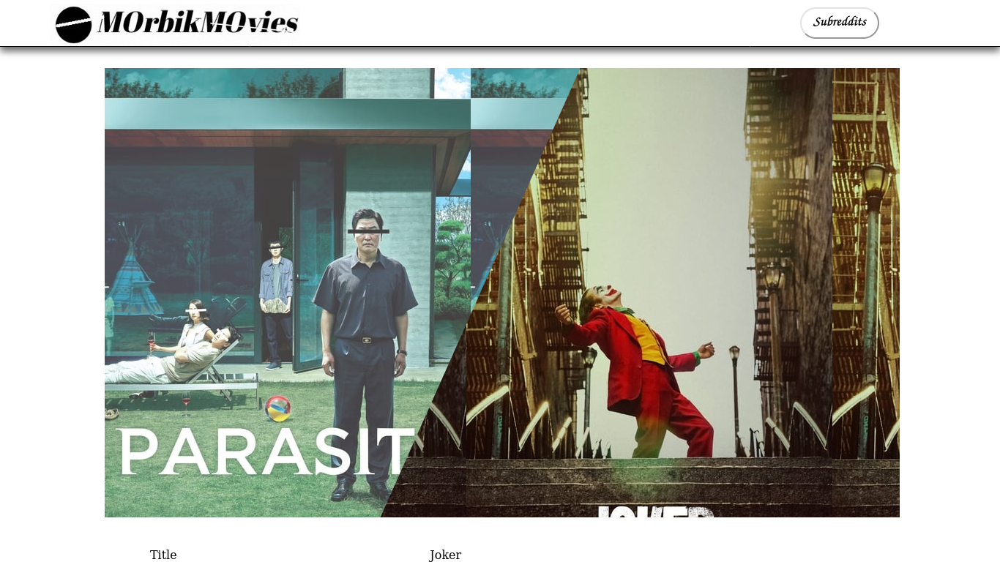
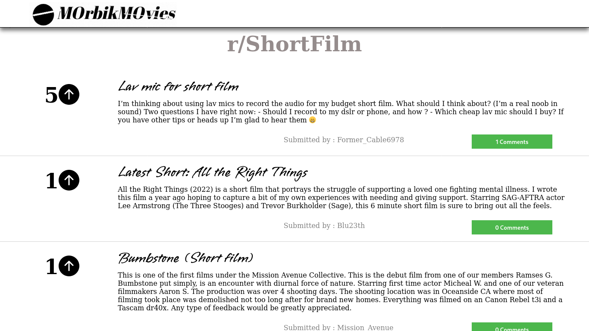
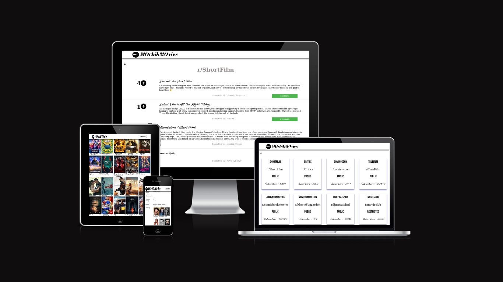

# Morbik Movies

This project utilized theMovieDB api show different movies and series and user can get a movie recommendation based on a similar movie they have seen before. 

    - The movies can be filtered and searched by movie title. 
    - It also suggests d/t movie subreddits that discuss movies by using the reddit api, 
      also found in rapid api.

 
    

### Built using
<code>#reactjs #css3 #themoviedatabase api #reddit api #netlify</code>

 

## Project Screenshots

 
 

<table>
    <tr>
        <td >
          
        </td>
        <td>
          
        </td>
    </tr>
     <tr>
        <td>
          
        </td>
        <td>
          
        </td>
    </tr>
</table>
 

 

<a href="https://morbik-movies.netlify.app/" > Go to project </a>

